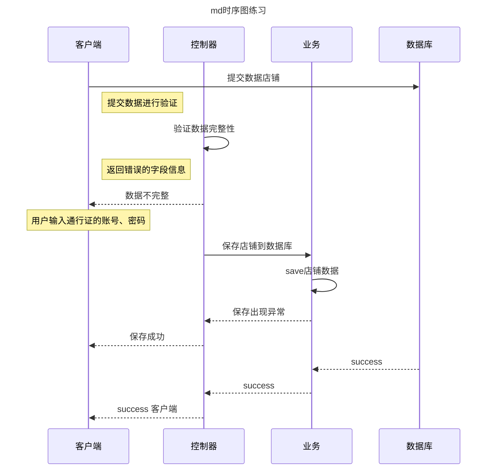

## 时序图画法

## typora 画时序图

本地上可以使用 typora, typora 是一个 markdown 软件. [typora.io](https://typora.io/)

typora 简单语法 [Draw-Diagrams-With-Markdown](https://support.typora.io/Draw-Diagrams-With-Markdown/)

typora 画时序图时机上使用的是 mermaid，一个 js 引擎。meramaid 高级语法 [https://mermaid-js.github.io/mermaid/#/sequenceDiagram](https://mermaid-js.github.io/mermaid/#/sequenceDiagram)

`->>`是实线

`-->>`是虚线

+是箭头，灰色长条 表示个一个过程

举例：

    ```mermaid
    sequenceDiagram
        Alice->>+John: Hello John, how are you?
        Alice->>+John: John, can you hear me?
        John-->>-Alice: Hi Alice, I can hear you!
        John-->>-Alice: I feel great!
    ```

可以别名

    ```mermaid
        participant J as John
        participant A as Alice
        A->>+J: Hello John, how are you?
        A->>+J: John, can you hear me?
        J-->>-A: Hi Alice, I can hear you!
        J-->>-A: I feel great!
    ```

复杂一点的



效果图:


## Draw.io 人工拖拽画时序图

[draw.io](https://app.diagrams.net/)

## plantUML 画时序图


可以用vscode插件[PlantUML](https://marketplace.visualstudio.com/items?itemName=jebbs.plantuml)

- 创建文件a.plantuml 注意后缀

- mac本地需安装

- ```sh
  brew install --cask temurin
  brew install graphviz
  ```

- Mac: option+D 快捷键预览

```scala

@startuml
control a as "X"
participant c as "Client"
participant s as "Server"
a -> c: 例子1
activate c

c -> s: fetch
activate s

c -> c: render

s --> c: callback
deactivate s

c -> c: render
return "ebd"
deactivate c

@enduml

```


- participant可以重命名

- return是虚线

- activate和deactivate应该成对出现，表示一个竖条。有了return会自动deactivate，所以deactivate可以用return替代，return的是虚线而不是实线。下面的就会在b上有长条了。

- ```scala
  a->b: xxx
  activate b
  return "xxx"
  ```

  

